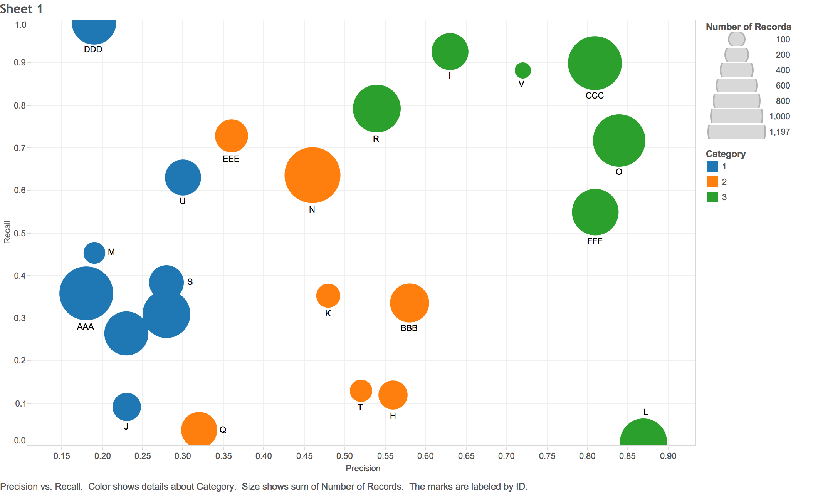

```{r setup, include=FALSE}
knitr::opts_chunk$set(echo = TRUE)
```

## Bubble Chart

Bubble Charts are a great way to illustrate additional dimensions to a plot. Let's suppose I was working on a project that was classifying data to a number of different categories. To illustrate classification performance, I might want to look at the precision and recall metrics across the project:

Your normal scatter plot can only show those two dimensions:

```{r bub1, echo=FALSE}
setwd("~/Data_Projects/visualizations")
bub <- read.csv("BubbleData.csv")
plot(bub$Precision,bub$Recall,xlab="Precision", ylab="Recall" )
text(bub$Precision, bub$Recall+.03, bub$ID, cex=0.5)
```

By encoding additional dimensions to the type, color or size of the points that are plotted, we can communicate additional data on the same chart. Here I have drawn each bubble with an area that is proportional to the number of records within that classification, and color coded the plotted points to the subcategory within a heirarchy.

```{r bub2, echo=FALSE}
#we want to scale the bubbles by area, not radius
radius = sqrt( bub$Number.of.Records/ pi )


symbols(bub$Precision,bub$Recall,circles=radius,
        inches=0.15, fg="white", bg=(bub$Category+1), xlab="Precision", ylab="Recall")
text(bub$Precision, bub$Recall, bub$ID, cex=0.5)
```

From this plot, we can now see that category 3, shown in blue, has higher precision than the other two categories, shown in green and red. Perhaps this information will be useful in tuning our classifier.

Of course, this can be done very quickly and easily using a data visualization tool like Tableau. The bubble chart below was put together in just a minute or two.



