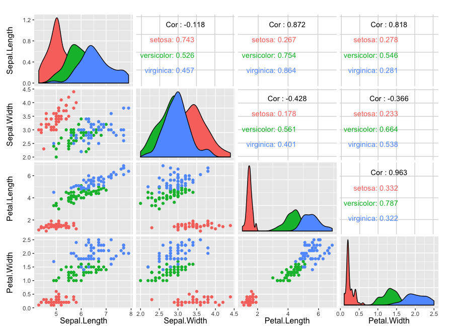

```{r setup, include=FALSE, echo=FALSE}
knitr::opts_chunk$set(echo = TRUE)
```

## Scatterplot Matrix

Scatterplot matrices are nice ways of visually exploring relationships between variables and outcomes. Here I'm using the classic iris data set to demonstrate how to use this tool. For instances where there are many more features you'll want to automatically look at similarities/correlations, skewness, etc. In this case, there's a really nice package in R (GGally) that makes this a one liner.  


```{r fig.width = 10, fig.height = 6}
library(GGally)
library(ggplot2)
ggpairs(iris, columns=c("Sepal.Length","Sepal.Width", "Petal.Length","Petal.Width"),
        mapping=aes(color=Species))
```

